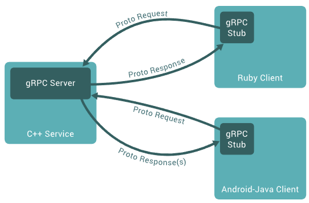

# gRPC

**gRPC** is a high performance, open source RPC framework initially developed by Google.
The framework is based on a **client-server model** of remote procedure calls.
A client application can directly call methods on a server application as if it was a local object.


## Overview
In gRPC, a client application can directly call a method on a server application on a different machine as 
if it were a local object, making it easier for us to create distributed applications and services. 

As in many RPC systems, gRPC is based around the idea of **defining a service**, specifying the methods that 
can be called remotely with their parameters and return types. 

On the **server side**, the server implements this interface and runs a gRPC server to handle client calls. 
On the **client side**, the client has a stub (referred to as just a client in some languages) that provides 
the same methods as the server.



gRPC clients and servers can run and talk to each other in a **variety of environments**.
For example, you can easily create a gRPC server in Java with clients Python or Ruby.


## Protocol Buffers

By default, gRPC uses Protocol Buffers, Google’s mature open source mechanism for serializing structured data.

The first step when working with protocol buffers is to define the structure for the data you want to serialize 
in a **proto file**: this is an ordinary text file with a `.proto` extension. 
Protocol buffer data is structured as **messages**, where each message is a small logical record of information 
containing a series of name-value pairs called fields.

```
message HelloRequest
{
    string firstName = 1;
    string lastName = 2;
}

message HelloResponse
{
    string greeting = 1;
}
```

Then, once we have specified our data structures, we use the **protocol buffer compiler** `protoc` to generate 
data access classes in our **preferred language(s)** from our proto definition.

While protocol buffers have been available to open source users for some time, most examples from this site use 
**protocol buffers version 3** (proto3).


## Interface Definition Language 
By default, gRPC uses **protocol buffers** as the Interface Definition Language (IDL) for describing both the service 
interface and the structure of the payload messages.

_Example_: Service definition
```
service HelloService
{
    rpc hello(HelloRequest) returns (HelloResponse);
}
```

gRPC lets us define four **kinds of service method**:

* **Unary RPCs** where the client sends a single request to the server and gets a single response back, 
    just like a normal function call.

    _Example_: `rpc SayHello(HelloRequest) returns (HelloResponse);`

* **Server streaming RPCs** where the client sends a request to the server and gets a stream to read a sequence 
    of messages back. The client reads from the returned stream until there are no more messages. 
    gRPC guarantees message ordering within an individual RPC call.

    _Example_: `rpc LotsOfReplies(HelloRequest) returns (stream HelloResponse);`

* **Client streaming RPCs** where the client writes a sequence of messages and sends them to the server, 
    again using a provided stream. 
    Once the client has finished writing the messages, it waits for the server to read them and return its response. 
    Again gRPC guarantees message ordering within an individual RPC call.

    _Example_: `rpc LotsOfGreetings(stream HelloRequest) returns (HelloResponse);`

* **Bidirectional streaming RPCs** where both sides send a sequence of messages using a read-write stream. 
    The two streams operate independently, so clients and servers can read and write in whatever order they like: 
    for example, the server could wait to receive all the client messages before writing its responses, 
    or it could alternately read a message then write a message, or some other combination of reads and writes. 
    The order of messages in each stream is preserved.

    _Example_: `rpc BidiHello(stream HelloRequest) returns (stream HelloResponse);`


## Using the API

Starting from a service definition in a .proto file, gRPC provides protocol buffer compiler plugins that generate 
client- and server-side code. 
gRPC users typically call these APIs on the client side and implement the corresponding API on the server side.

* On the **server side**, the server implements the methods declared by the service and runs a gRPC server 
    to handle client calls. The gRPC infrastructure decodes incoming requests, executes service methods, 
    and encodes service responses.

* On the **client side**, the client has a local object known as stub (for some languages, the preferred term 
    is client) that implements the same methods as the service. 
    The client can then just call those methods on the local object, wrapping the parameters for the call in the 
    appropriate protocol buffer message type - gRPC looks after sending the request(s) to the server and 
    returning the server’s protocol buffer response(s).

## References
* [YouTube: Intro to gRPC](https://youtu.be/3Kkj6vAW5a4)

* [Introduction to gRPC](https://grpc.io/docs/what-is-grpc/introduction/)

* [Core concepts, architecture and lifecycle](https://grpc.io/docs/what-is-grpc/core-concepts/)


*Egon Teiniker, 2020-2021, GPL v3.0*