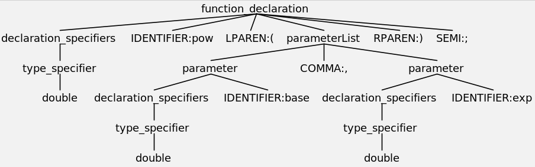
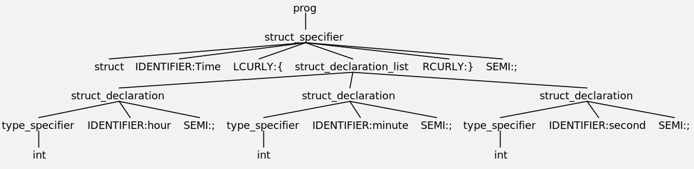

# ANTLR 4 Grammar Examples

**ANTLR (ANother Tool for Language Recognition)** is a powerful parser generator for reading, processing, 
executing, or translating structured text or binary files. 
It's widely used to build languages, tools, and frameworks. 

From a grammar, ANTLR generates a parser that can build and walk parse trees.

We use ANTLR to investigate how **source code can be transformed into an abstract model**.


## Example: C Function Declaration
```C
double pow(double base, double exp);
```




## Example: C Struct Definition

```C
struct Time 
{
    int hour;
    int minute;
    int second;
};
```



## References 
* [YouTube: ANTLR4 Intellij Plugin -- Parser Preview, Parse Tree, and Profiling](https://youtu.be/0A2-BquvxMU)
* [ANTLR (ANother Tool for Language Recognition)](https://www.antlr.org/)


*Egon Teiniker, 2017-2023, GPL v3.0*


